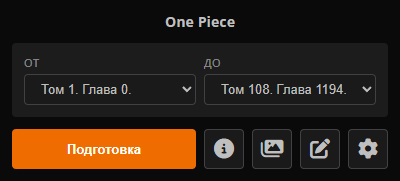
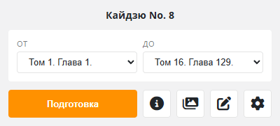

# ~ LibSaver ~

Скачивание любимых тайтлов с **MangaLIB**, **HentaiLIB**, **SlashLIB** и **RanobeLIB**!

Расширение бережно и аккуратно собирает метаданные, обложки, переводы и главы со страницы тайтла.

Перед скачиванием можно тщательно настроить:
- **Сжатие и конвертацию изображений** - если нужно сэкономить память на устройстве
- **Оглавление и заголовки** - если у тайтла всего один том или одна глава
- **Информацию о тайтле** - если нужна титульная страница с автором, описанием, тегами и др.
- **Обложки** - если у тайтла несколько обложек или нужна определённая
- **Главы** - если нужен не весь тайтл, а только Том 8 или вообще Главы 2, 7, 19 - никто вас не остановит!
- **Переводы** - если над тайтлом поработало несколько сотен шальных рук

Подробнее о всех настройках, возможностях и нюансах [здесь](SETTINGS.md).

Приятного чтения! <3

## Основные функции

- Поддержка различных форматов: от CBZ и EPUB до PDF и TXT
- Гибкий выбор: весь тайтл целиком, отдельные тома или конкретные главы
- Полный контроль над обложками, переводами и метаданными
- Исходное качество картинок с возможностью конвертации и сжатия

## Поддерживаемые форматы

- EPUB
- PDF
- FB2 (только для RanobeLIB)
- TXT + картинки (только для RanobeLIB)
- CBZ / ZIP (только манга-сайты)
- HTML (в разработке)

## Установка (Вариант 1)

1. Скачайте исходный код `LibSaver-main.zip` [отсюда](https://github.com/dfy-dpg/LibSaver/archive/refs/heads/main.zip) или клонируйте репозиторий.
2. Распакуйте архив в любую папку.
3. В браузере перейдите в "Управление расширениями":
   - Для Chrome: `chrome://extensions`
   - Для Edge: `edge://extensions`
4. Включите "Режим разработчика".
5. Нажмите "Загрузить распакованное расширение".
6. Выберите распакованную из архива папку `src`.
7. Расширение готово к использованию.

<b>Установка (Вариант 2)</b>

## Установка (Вариант 2) - Релиз в скором времени!

1. Скачайте файл `LibSaver-vA.B.zip` из последнего [релиза](https://github.com/dfy-dpg/LibSaver/releases/latest).
2. Распакуйте архив в любую папку.
3. В браузере перейдите в "Управление расширениями":
   - Для Chrome: `chrome://extensions`
   - Для Edge: `edge://extensions`
4. Включите "Режим разработчика".
5. Нажмите "Загрузить распакованное расширение".
6. Выберите распакованную из архива папку `LibSaver-vA.B`.
7. Расширение готово к использованию.

## Использование

1. Перейдите на главную страницу нужного тайтла.
2. Кликните на иконку расширения на панели браузера.
3. В открывшемся окне нажмите кнопку "Подготовка".
4. Проверьте настройки, выберите формат и нажмите "Скачать".
5. Дождитесь завершения загрузки и сохраните файл.

## Немного истории

Мне нужно было скачать некоторые тайтлы с **RanobeLIB**, но удобное и подходящее для себя решение не нашёл... Так и родилось браузерное расширение **RanobeDL**. А через время была проведена крупная работа над функционалом, дизайном и добавлена поддержка манга-сайтов, так оно переродилось в **LibSaver**.

## Обратная связь и поддержка

Буду рад любой обратной связи, идеям, а если вы поставите звёздочку, то вообще лопну от счастья!!! :*

## Заметки

- Скачивание в формате HTML уже в разработке.
- Поддержка Mozilla Firefox планируется...
- Поддержка AnimeLIB планируется (прям в мечтах)...

## Лицензия

[GPL-3.0 license](LICENSE)
