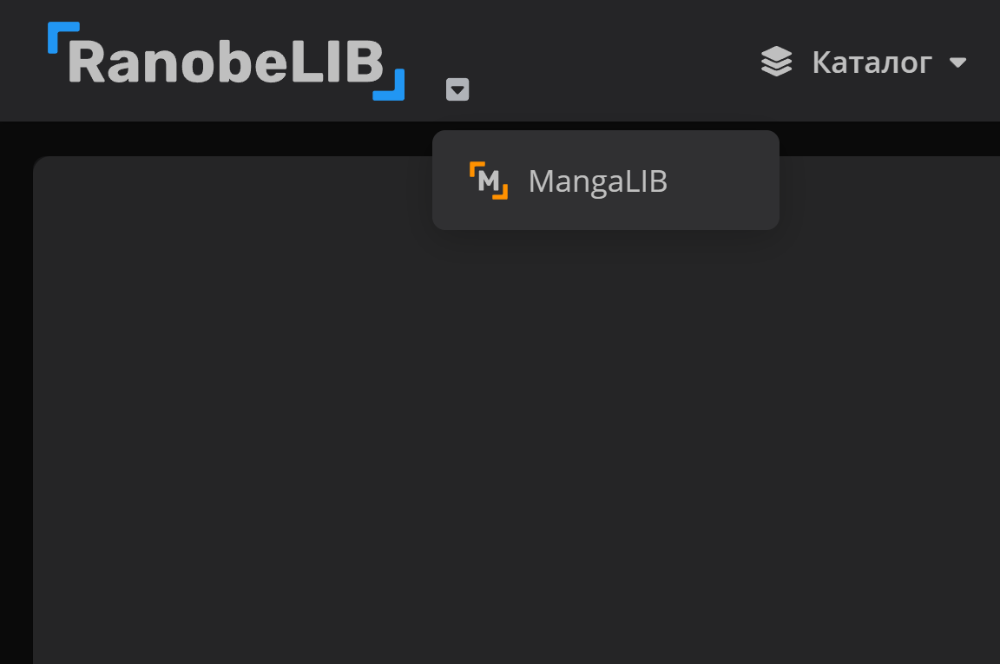
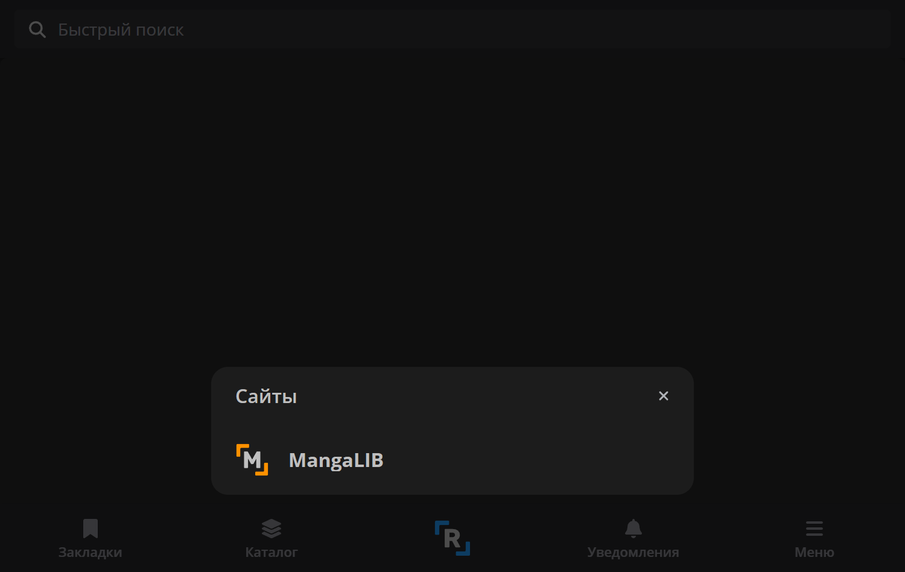
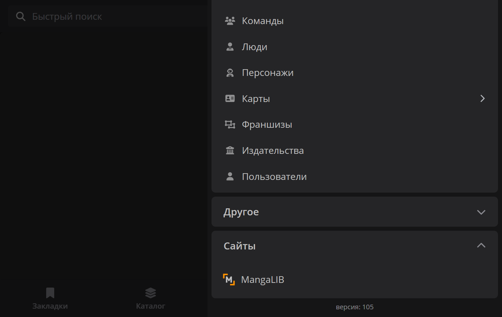
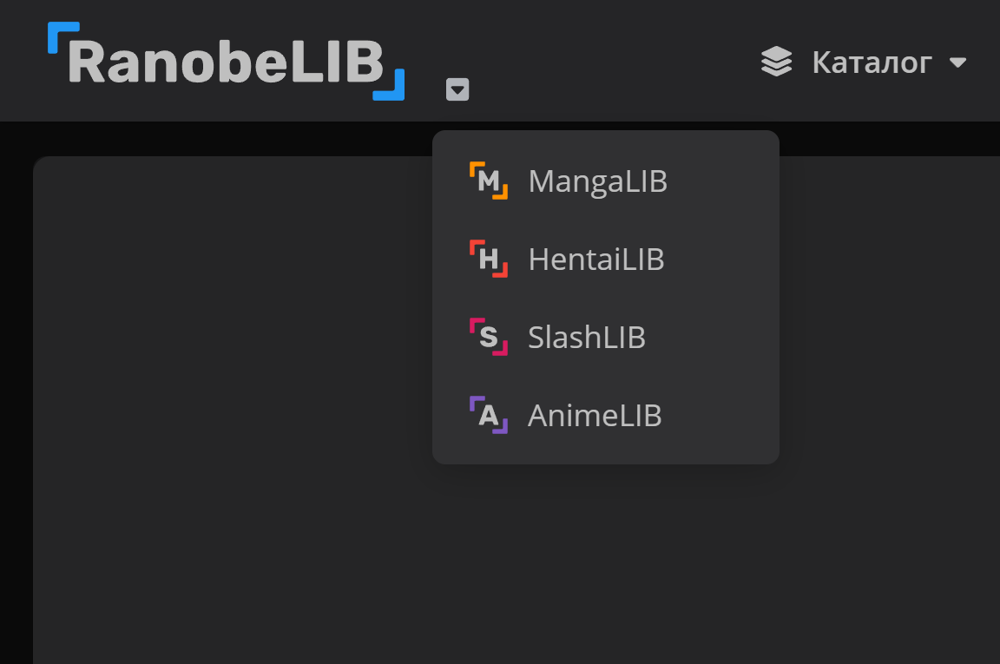
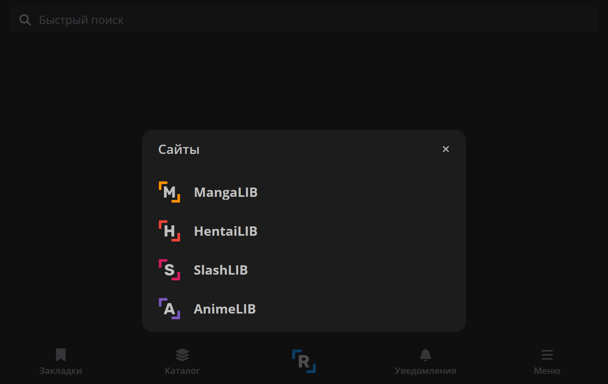
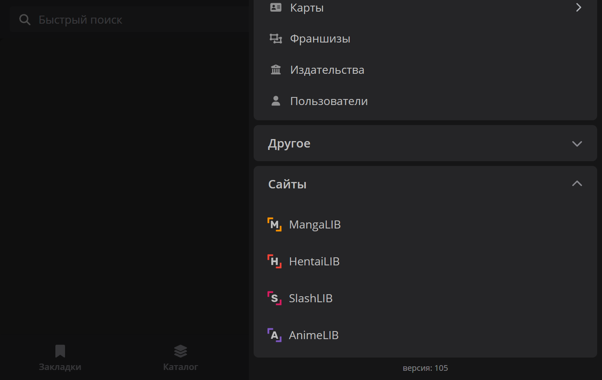

# Настройки LibSaver

**Статус документации**: соответствует последнему [релизу](https://github.com/dfy-dpg/LibSaver/releases/latest).

Здесь подробно описана каждая настройка и некоторые нюансы. 
Если заметили ошибку, несостыковку или возник вопрос, появилась идея - сообщите! 
Со временем настройки могут изменяться, добавляться и даже удаляться.

Здесь есть две основные секции: [Главное окно настроек](#главное-окно-настроек) и [Параметры вне окна настроек](#параметры-вне-окна-настроек).

## Главное окно настроек

**Окно с настройками поделено на две части**:
- **Панель, где можно**:
  - Сохранить выставленные параметры
  - Сбросить все параметры к значениями по умолчанию
  - Выбрать тему: Светлая и Тёмная
  - Выбрать цвет:
    - Авто - меняет цвет в зависимости от сайта, где вы открыли расширение
    - Принудительный цвет, вне зависимости от того, где вы открыли расширение
  - Открыть этот репозиторий/Связаться со мной
- **Основное окно, где есть следующие группы настроек**:
  - Общие
  - Редактор оглавления
  - Обработка изображений
  - Оглавление
  - CBZ/ZIP
  - PDF
  - TXT

Сбросить настройки можно отдельно для каждой группы.

### Группа "Общие"

- **Улучшенное меню сайтов** - добавляет/убирает, изменяет порядок и ссылки на сайты в меню возле логотипа на усмотрение пользователя

📁 <b><i>Демонстрация настройки, если она отключена (пользователь не зарегистрирован)</i></b>

 

||||
|--|--|--|

📁 <b><i>Демонстрация настройки, если она включена (пользователь не зарегистрирован)</i></b>

 

||||
|--|--|--|

- **Подробное логирование** - показывает больше логов (изначальная картинка, сжатие и конвертация, выбранный и попавший в файл перевод)
- **Уведомлять о наличии обновлений** - при открытии popup появляется toast, если доступна новая версия

### Группа "Редактор оглавления"

- **Пагинация** - если у тайтла глав больше _**100-1000**_ (настраивается ползунком ниже), то в редакторе будет _**100-1000**_ глав, остальные появятся при нажатии на кнопку "Показать ещё" или "Показать все"
  - **Первоначальное количество глав** - максимальное кол-во глав при открытии редактора
  - **Количество глав при загрузке** - максимальное кол-во глав при нажатии на кнопку "Показать ещё"

### Группа "Обработка изображений"

- **Качество обложек (не касается картинок внутри глав)**:
  - Без обложек - не скачивает обложки, в файле не будет обложек
  - Без сжатия - скачивает обложки в оригинальном качестве
  - от 1600px до 480px - сжимает одну из сторон обложки (см. Метод Сжатия) до указанного значения
- **Качество картинок (не касается обложек)**:
  - Без картинок - не скачивает картинки, в файле не будет картинок
  - Без сжатия - скачивает картинки в оригинальном качестве
  - от 1600px до 480px - сжимает одну из сторон картинки (см. Метод Сжатия) до указанного значения
- **Метод сжатия (появляется, если в настройках выше выставить 1600px-480px)**:
  - По меньшей стороне (см. Таблицу и примеры ниже)
  - По большей стороне (см. Таблицу и примеры ниже)
  - Адаптивный (см. Таблицу и примеры ниже)

📁 <b><i>Таблица с описанием методов сжатия</i></b>

 

| Метод | Описание | Когда использовать |
|-------|----------|-------------------|
| По меньшей стороне | Исходное изображение сжимается так, чтобы меньшая сторона не превышала заданный размер. | Для большинства изображений, обеспечивает оптимальный баланс между размером и качеством. |
| По большей стороне | Исходное изображение сжимается так, чтобы большая сторона не превышала заданный размер. Сохраняет пропорции. | Если нужно максимальное сжатие и минимальный размер файла. |
| Адаптивный | Проверяет соотношение сторон: если исходное изображение слишком вытянутое (например, 3:1), сжатие не применяется. Если соотношение сторон не превышает заданное, то работает как "По меньшей стороне". | Для сохранения качества вытянутых картинок и сжатия обычных картинок. |

📁 <b><i>Примеры методов сжатия</i></b>

 

**Метод «По меньшей стороне» (Качество: 1080px)**
- 2000×1500 → 1440×1080 (меньшая сторона 1500 > 1080 → **сжимаем**)
- 2000×2000 → 1080×1080 (меньшая сторона 2000 > 1080 → **сжимаем**)
- 1920×1080 → 1920×1080 (меньшая сторона 1080 = 1080 → **оставляем**)
- 1280×720 → 1280×720 (меньшая сторона 720 < 1080 → **оставляем**)
- 1500×2000 → 1080×1440 (меньшая сторона 1500 > 1080 → **сжимаем**)

**Метод «По большей стороне» (Качество: 1080px)**
- 2000×1500 → 1080×810 (большая сторона 2000 > 1080 → **сжимаем**)
- 2000×2000 → 1080×1080 (большая сторона 2000 > 1080 → **сжимаем**)
- 1080×720 → 1080×720 (большая сторона 1080 = 1080 → **оставляем**)
- 960×540 → 960×540 (большая сторона 960 < 1080 → **оставляем**)
- 1500×2000 → 810×1080 (большая сторона 2000 > 1080 → **сжимаем**)

**Адаптивный метод (Качество: 1080px, Порог: 3 к 1)**
- 4000×1200 → 4000×1200 (соотношение 3.3:1 ≥ 3:1 → **оставляем**)
- 3000×1000 → 3000×1000 (соотношение 3:1 = 3:1 → **оставляем**)
- 1280×720 → 1280×720 (соотношение 1.7:1 < 3:1 → меньшая 720 < 1080 → **оставляем**)
- 2000×1500 → 1440×1080 (соотношение 1.3:1 < 3:1 → меньшая 1500 > 1080 → **сжимаем**)
- 1200×4000 → 1200×4000 (соотношение 3.3:1 ≥ 3:1 → **оставляем**)

**Адаптивный метод (Качество: 1080px, Порог: 2 к 1)**
- 3000×1200 → 3000×1200 (соотношение 2.5:1 ≥ 2:1 → **оставляем**)
- 2000×1000 → 2000×1000 (соотношение 2:1 = 2:1 → **оставляем**)
- 1280×720 → 1280×720 (соотношение 1.7:1 < 2:1 → меньшая 720 < 1080 → **оставляем**)
- 2000×1500 → 1440×1080 (соотношение 1.3:1 < 2:1 → меньшая 1500 > 1080 → **сжимаем**)
- 1500×2000 → 1080×1440 (соотношение 1.3:1 < 2:1 → меньшая 1500 > 1080 → **сжимаем**)

- **Формат изображений (настройка влияет на все форматы, кроме PDF)**:
  - Исходный - скачивает картинки и обложки в формате, который отдаёт сайт
  - `JPEG` - принудительно конвертирует всё, что не является `JPEG` в `JPEG`
  - `PNG` - принудительно конвертирует всё, что не является `PNG` в `PNG`
  - `WebP` - принудительно конвертирует всё, что не является `WebP` в `WebP`

> [!CAUTION]
> Если выставить "Исходный", то сайт может отдавать _специфичные_ форматы: `AVIF`, `GIF` и другие! 
> Убедитесь, что ваша читалка будет их поддерживать, иначе - поставьте конвертацию в `JPEG` или `PNG`.

- **Качество `JPEG`/`WebP` (появляется, если в настройке выше выбрать `JPEG` или `WebP`)** - позволяет выставить значение от 0.1 до 1 (чем меньше значение - тем шакальнее картинка)

### Группа "Оглавление"

- **Формат заголовков** - влияет на то, какими будут заголовки глав, доступные варианты:
  - Том X Глава Y Название
  - Том X Глава Y - Название
  - Том X - Глава Y - Название
  - Том X / Глава Y / Название
  - Том X. Глава Y. Название
  - Том X Глава Y (если стоит галочка "Скрыть названия глав")
  - Том X - Глава Y (если стоит галочка "Скрыть названия глав")
  - Том X / Глава Y (если стоит галочка "Скрыть названия глав")
  - Том X. Глава Y. (если стоит галочка "Скрыть названия глав")
  - Глава Y Название (если стоит галочка "Скрыть номера томов")
  - Глава Y - Название (если стоит галочка "Скрыть номера томов")
  - Глава Y / Название (если стоит галочка "Скрыть номера томов")
  - Глава Y. Название (если стоит галочка "Скрыть номера томов")
  - Глава Y (если стоят обе галочки)
  - Глава Y. (если стоят обе галочки)
  - Без заголовков
  - Пользовательский формат (самостоятельно разместить значения Тома `{vol}`, Главы `{num}` и Названия `{name}`) - на него не влияют галочки скрытия тома или названия
- **Скрыть номера томов** - убирает слово "Том" и номер тома из предустановленных форматов
- **Скрыть названия глав** - убирает слово "Глава" и номер глав из предустановленных форматов
- **Отключить оглавление** - отключает оглавление во всех форматах

📁 <b><i>Примеры выставления пользовательского формата</i></b>

 

**Пример 1** 
**На сайте**: Том 1 Глава 0 - Пролог 
**Ввели**: `Т.{vol}, Г.{num}` 
**Получили**: Т.1, Г.0 
 
**Пример 2** 
**На сайте**: Том 9 Глава 2 - Это любовь?! 
**Ввели**: `{vol}-{num}-{name}` 
**Получили**: 9-2-Это любовь?! 
 
**Пример 3** 
**На сайте**: Том 1 Глава 22 
**Ввели**: `Глава {vol} - {name}` 
**Получили**: Глава 22 -  
 
**Пример 4** 
**На сайте**: Том 1 Глава 22 
**Ввели**: `[Глава {vol}] - [{name}]` 
**Получили**: Глава 22 

> [!WARNING]
> При использовании своего формата - учитывайте то, что на сайте может не быть названия главы! 
> Иначе может выйти что-то вроде "Том 1 / Глава 22 / " или "Глава 22 - " и т.д. 
>  
> Предустановленные форматы учитывают это.

> [!IMPORTANT]
> Если у вас **v1.7** и **старше**, то были добавлены "**секции**"! 
> Секцией считается то, что заключено в квадратные скобки! 
> Секции призваны решить проблему выше. Пример: 
> **Пользовательский формат**: "! [Том {vol}] @ [Глава {num}] # [{name}] $" 
> **Если глава с названием**: "! Том 4 @ Глава 31 # Ёрико $" 
> **Если глава без названия**: ! Том 4 @ Глава 31 $"

### Группа "CBZ/ZIP"

> [!NOTE]
> Все настройки из этой группы влияют только на `CBZ/ZIP` формат! 
> И никак не взаимодействуют с другими форматами!

- **ComicInfo.xml** - генерирует xml-файл метаданных, который может быть обнаружен читалками

### Группа "PDF"

> [!NOTE]
> Все настройки из этой группы влияют только на `PDF` формат! 
> И никак не взаимодействуют с другими форматами!

- **Шрифт** (пять с засечками и пять без)
- **Размер шрифта** (от 6pt до 20pt)
- **Размер страницы** (A6, A5, A4, Letter, B5, B4) - не влияет на изображения, т.к. для них создаётся специальная страница с размером самого изображения
- **Межстрочный интервал** (от 0px до 5px)
- **Отступ между абзацами** (от 0.5 до 2.0) - умножается на размер шрифта
- **Формат изображений**:
  - **Исходный, иначе `PNG`** - скачивает картинки в исходном формате, если они являются `JPEG` или `PNG`, иначе конвертирует в `PNG`
  - **Исходный, иначе `JPEG`** - скачивает картинки в исходном формате, если они являются `JPEG` или `PNG`, иначе конвертирует в `JPEG` с выбранным качеством
- **Качество `JPEG`** - позволяет выставить значение от 0.1 до 1 (чем меньше значение - тем шакальнее картинка)

### Группа "TXT"

> [!NOTE]
> Все настройки из этой группы влияют только на `TXT` формат! 
> И никак не взаимодействуют с другими форматами!

- **Маркер картинок** - добавляет надпись в местах, где должна быть картинка

Если _тыкнуть_ на надпись "LibSaver vA.B" в самом низу, то будет произведена проверка версии.

## Параметры вне окна настроек

Всё, что находится вне окна "Настройки" - Редактор метаданных, обложек, оглавления и окно "Подготовка".

### Окно "Подготовка"

- **Выбор формата (RanobeLIB)**:
  - **EPUB** - обложки, метаданные, оглавление, весь контент глав - основной формат
  - **FB2** - обложки, метаданные, оглавление, весь контент глав - хуже справляется с картинками
  - **PDF** - обложки, контент глав - **очень требовательный!** - использовать осторожно - лучше качать с сжатием до 720px-1600px, либо в небольшом количестве (а то я так поймал картинку ~10000x10000px) - кроме того, у глав "Старого формата" (расширение напишет в логах и в статистике, если найдёт такие) он может складировать картинки в начале главы, а уже затем идёт текст
  - **TXT** - обложки, метаданные, весь контент глав (в главах на местах картинок будет надпись-метка) - можно скачать как обычный `.txt`, либо `.zip` с папками "Обложки", "Картинки" и `.txt`
- **Выбор формата (MangaLIB, HentaiLIB, SlashLIB)**:
  - **CBZ/ZIP** - обложки, весь контент глав - основной формат
  - **PDF** - обложки, весь контент глав - **очень требовательный!** - использовать осторожно - лучше качать с сжатием до 720px-1600px, либо в небольшом количестве
  - **EPUB** - обложки, метаданные, оглавление, весь контент глав
- **Сервер (MangaLIB, HentaiLIB, SlashLIB)**:
  - Первый/Второй - одинаковые, могут отправлять картинки в _специфичных_ форматах
  - Сжатия - обычно отдавал `JPEG` и `PNG`
- **Ускорить** - убирает паузы и ожидания - быстрее качает, но может прилететь за слишком частые запросы, можно поставить, если тайтл не длинный (около 50-80 глав) - галочку можно ставить и убирать прям во время скачивания
- **Выбор нужных глав** (в карточке "Главы) - можно быстро снять и выделить все главы в томе, а также выбрать отдельные главы

### Редактор оглавления

- **Приоритет перевода** (находится справа от кнопки "Очистить всё") - позволяет настроить приоритет перевода. Тот, что выше - приоритетнее.
- **Перевод отдельной главы** - можно выбрать перевод для каждой отдельной главы (если напротив главы пусто, значит у неё всего один перевод).

### Редактор метаданных

Поля можно **переименовывать**, **перемещать** и **отключать** (всё это влияет на страницу с метаданными в финальном файле). Если поле **пустое** или **отключено** - оно не попадёт в файл. Если все поля **пустые** или **отключены** - страница с метаданными не будет сгенерирована.

### Редактор обложек

Обложки обычно всегда загружаются с сайта, но встречал тайтлы, которые их **не отдавали** - будьте внимательны! 
Обложки можно загрузить локально с компьютера, либо указать URL (хоть с самих LIB сайтов, хоть из интернета)
